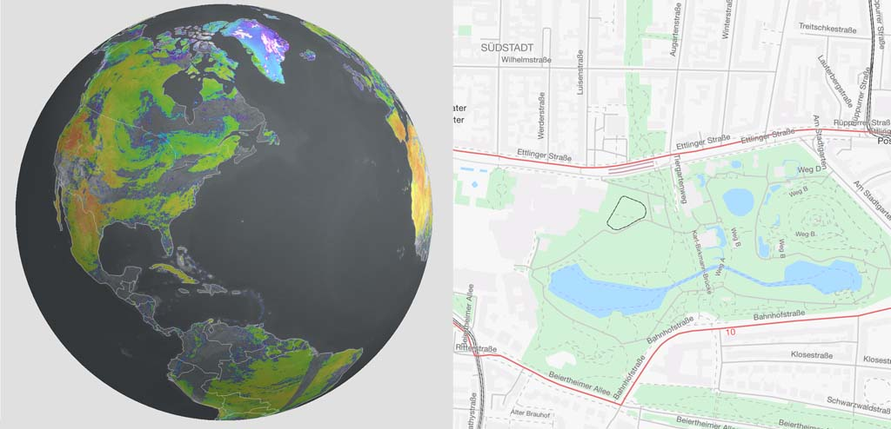

### About Us

mousebird consulting inc does geospatial data display for mobile devices and the back end to support it.  That's iOS, Android and the active services to support them.

Our work can be found in a wide variety of weather, aviation, education and miscellaneous apps.  We've been warming the pockets of millions of users worldwide for at least a decade.

As you might imagine, this is tricky stuff.  We're skilled in the ways of OpenGL ES, Metal, threading, networking, geospatial data processing, and user interfaces.  Our stuff is known for being fast and responsive on mobile devices and simple to run on the back end.

### Products & Services

Our biggest product is the open source [WhirlyGlobe-Maply toolkit](https://mousebird.github.io/WhirlyGlobe).  We have a number of [commercial offerings](products/) as well, so go check those out.

As the name suggests, we are consultants.  If you have a geospatial or weather product with a mobile component, we'd love to discuss it.

### Contact

You can talk to us at <a href="mailto:contact@mousebirdconsulting.com" target="_top">contact@mousebirdconsulting.com</a>.

Please join the <a href="http://eepurl.com/D30CD" target="_blank">mailing list</a> for infrequent announcements, usually related to <a href="http://mousebird.github.io/WhirlyGlobe" target="_blank">WhirlyGlobe-Maply</a>.

Check out our [blog](/blog.html) for technical discussion.

